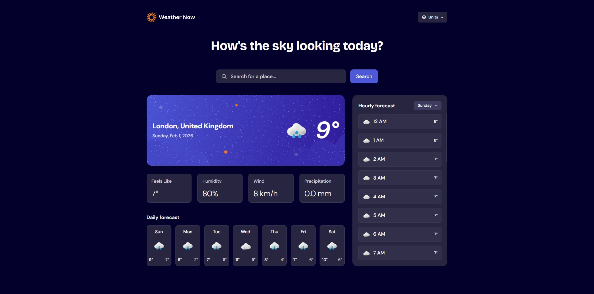

# Frontend Mentor - Weather app solution

This is a solution to the [Weather app challenge on Frontend Mentor](https://www.frontendmentor.io/challenges/weather-app-K1FhddVm49). Frontend Mentor challenges help you improve your coding skills by building realistic projects.

A simple and responsive weather application that displays current weather, hourly forecast, and daily forecast based on the user's location or a searched place.

The app uses public APIs to fetch location and weather data and provides clear UI feedback for loading and error states.

## Table of contents

- [Frontend Mentor - Weather app solution](#frontend-mentor---weather-app-solution)
  - [Table of contents](#table-of-contents)
  - [Overview](#overview)
    - [The challenge](#the-challenge)
    - [Screenshot](#screenshot)
    - [Links](#links)
  - [Tech Stack](#tech-stack)
  - [Setup \& Usage](#setup--usage)
  - [Error Handling](#error-handling)
  - [Author](#author)

## Overview

### The challenge

Users should be able to:

- 🔍 Search for weather information by entering a location in the search bar
- 🌤️ View current weather conditions, including temperature, weather icon, and location details
- 🌡️ See additional weather metrics such as "feels like" temperature, humidity, wind speed, and precipitation
- 📅 Browse a 7-day weather forecast with daily high/low temperatures and weather icons
- 🕒 View an hourly forecast showing temperature changes throughout the day
- 📆 Switch between different days of the week using the day selector in the hourly forecast section
- ⚖️ Toggle between Metric and Imperial measurement units
- 🌡️ Switch between Celsius and Fahrenheit, wind speed units (km/h or mph), and precipitation units (mm or inches)
- 📱 View an optimal layout adapted to different screen sizes
- 🖱️ See hover and focus states for all interactive elements
- 📍 Automatically detect user location and display local weather on first visit

### Screenshot

### Links

- Solution URL: [Add solution URL here](https://your-solution-url.com)
- Live Site URL: [https://app-weathernow.netlify.app/]

## Tech Stack

- **HTML5**
- **tailwindcss**
- **JavaScript**
- **Open-Meteo API** (weather & geocoding)
- **BigDataCloud API** (reverse geocoding)

## Setup & Usage

1. Clone the repository or download ZIP
2. Open `index.html` in your browser
3. Allow location access (optional)
4. Search for a city

## Error Handling

The application handles:
- Location access denial or unavailability
- No internet connection
- API request failures
- No search results found

Errors are displayed using predefined UI elements without recreating DOM nodes.

## Author

- Frontend Mentor - [@St3f4nn](https://www.frontendmentor.io/profile/St3f4nn)